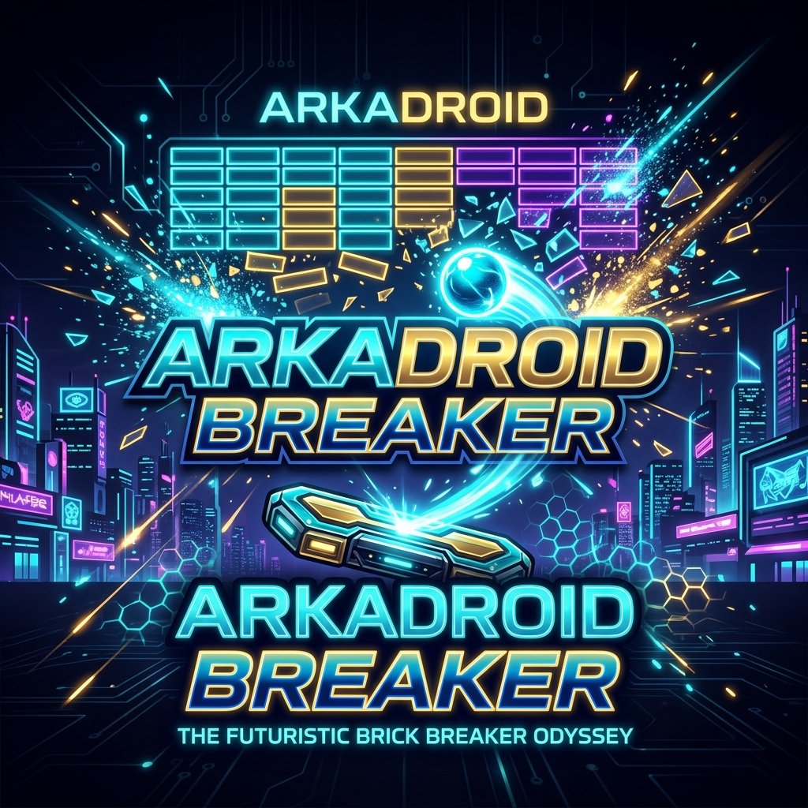

# Arkadroid Breaker — Neon Retro Arcade Brick Breaker



Arkadroid Breaker is a high-fidelity, production-grade Brick Breaker game developed in C++17 leveraging the simple and fast multimedia library (**SFML**). Built around industry-standard Object-Oriented Programming (OOP) paradigms, Arkadroid showcases clean architecture, runtime polymorphism, encapsulated states, visual particles, and responsive physical collisions.

---

## 🚀 Key Features

* **🎨 Neon Retro Aesthetic**: Modern neon color scheme, visual drop shadows, glassmorphism UI overlay, and responsive particle burst animations on brick destruction.
* **🕹️ Three Progressive Levels**:
  * **Level 1 (Learning Phase)**: Standard grid pattern, mouse-controlled lower paddle, base speed ball.
  * **Level 2 (Tactical Ascent)**: Descending staircase layout, faster ball kinetics (1.3x speed).
  * **Level 3 (Expert Fractal)**: Dual-paddle coordination (Lower: mouse, Upper: keyboard `W` and `R`), recursive fractal layout, 1.6x speed, dual-boundary loss conditions.
* **⚡ Polymorphic Power-Ups (Foods)**:
  * 🟢 **Green Food** (Triangle): Expand paddle width.
  * 🔴 **Red Food** (Rectangle): Temporal ball acceleration (1.5x speed).
  * 🔵 **Blue Food** (Circle): Temporal ball deceleration (0.5x speed).
  * 💗 **Pink Food** (Square): Shrink paddle width.
  * 🟡 **Yellow Food** (Square): Spawn dual additional balls for high-intensity action.
* **📂 Game State & Leaderboards**: Save game states dynamically and track high scores locally via local I/O persistence.

---

## 🛠️ Build and Installation

### Prerequisites

To compile the codebase from source, ensure you have:
* **C++17 Compiler** (e.g., GCC 9+, MSVC 2019+, or Clang 10+)
* **SFML Development Libraries** (Version 2.5.x or 2.6.x)
* **Make** utility or PowerShell command availability

### Compilation Methods

#### Option 1: GNU Make (Recommended for Linux/macOS/MinGW)
```bash
make clean
make
./Arkadroid   # For Windows: Arkadroid.exe
```

#### Option 2: Windows Batch Script
Simply double-click or run from command prompt:
```cmd
build.bat
```

---

## 🎮 Game Controls

### Gameplay Inputs
* **Lower Paddle**: Follows the system mouse cursor automatically horizontally.
* **Upper Paddle (Level 3)**:
  * **W Key**: Move Paddle Left
  * **R Key**: Move Paddle Right
* **Utility Controls**:
  * **P / Escape**: Pause/Resume game loop.
  * **R Key (Game Over Screen)**: Restart the level immediately.

### Menu Selection
* **Num Keys (1-4)** or **Mouse Click**: Navigate and select choices.
* **Enter Key**: Submit name input.
* **Escape Key**: Go back to the main menu.

---

## 📐 Object-Oriented Architecture

```
                            +--------------------------+
                            |     sf::RenderWindow     |
                            +--------------------------+
                                         ^
                                         | (uses-a)
                                         |
                            +--------------------------+
                            |           Game           |
                            +--------------------------+
                               /         |          \
                       (has-a)/   (has-a)|           \(has-a)
                             v           v            v
                +---------------+ +--------------+ +---------------+
                |  ScoreManager | | FileHandler  | |     Paddle    | (Lower Paddle)
                +---------------+ +--------------+ +---------------+
                             ^                               ^
                             | (uses-a)                      | (has-a, in L3)
                             |                               |
                             v                               |
                +---------------+                            |
                |     Level     |----------------------------+ (Upper Paddle)
                +---------------+
                  /     |     \
        (extends)/      |      \(extends)
                v       v       v
           +--------+ +--------+ +--------+
           | Level1 | | Level2 | | Level3 | (Fractal Layout)
           +--------+ +--------+ +--------+
```

### OOP Principles Utilized

1. **Encapsulation**: Private and protected members guarded by rigorous getter/setter API protocols.
2. **Inheritance & Abstraction**:
   * `Brick` abstract class -> `GreenBrick`, `PinkBrick`, `BlueBrick`, `RedBrick`, `YellowBrick`
   * `Food` abstract class -> `GreenFood`, `PinkFood`, `BlueFood`, `RedFood`, `YellowFood`
   * `Level` abstract base -> `Level1`, `Level2`, `Level3`
3. **Runtime Polymorphism**: Custom dynamic dispatching for virtual interfaces like `draw()`, `takeDamage()`, `applyEffect()`, and `generatePattern()`.
4. **Deep Copy Semantics**: Custom copy constructor implementations inside `Ball` and `Paddle` to manage multi-ball duplicates and dual-paddle instances safely.

---

## 🗃️ Code Directory Structure

```
OOP_Finalproject/
├── Ball.h / Ball.cpp                  # Ball Physics and Collisions
├── Brick.h / Brick.cpp                # Abstract Base Brick
├── [Color]Brick.h/cpp                 # Polymorphic Brick implementations
├── Food.h / Food.cpp                  # Abstract Base Powerup / Food
├── [Color]Food.h/cpp                  # Timed Powerup effects
├── Paddle.h / Paddle.cpp              # Paddle controller bounds
├── Level.h / Level.cpp                # Base level configurations
├── Level[1-3].h/cpp                   # Custom level patterns (L3 uses Recursion)
├── HUD.h / HUD.cpp                    # Floating heads-up display dashboard
├── FileHandler.h / FileHandler.cpp    # Data persistence and file state management
├── UIManager.h / UIManager.cpp        # State management (Menu, Scores, High Score)
├── ParticleSystem.h / ParticleSystem.cpp # Visual collision particle emitters
├── GraphicsEnhancer.h / cpp           # Shadows, glow effects, premium rendering
├── main.cpp                           # Entry Point and game thread coordinator
├── Makefile / build.bat               # Compiling toolchain automated scripts
└── arkadroid_banner.png               # High-fidelity preview banner image
```

---

*Enjoy playing Arkadroid Breaker! Designed with robust architecture and premium classic aesthetics.*
